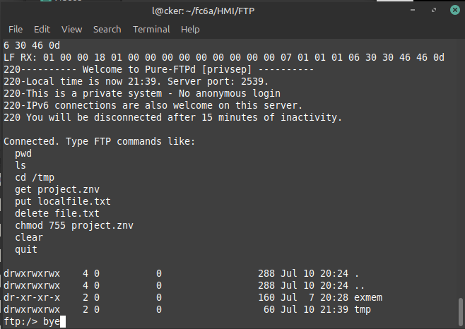

#HMI: tested on HG2J-7U

<pre>
HOW IT WORKS:
Maintenance protocol commands are sent to the HMI.

The PC tells the HMI, this 16 btye string is your user.
and this 15 byte string is your password.
The HMI then enstantiates an FTP Session on port 2539
the user then may log in, with an active service window of 15 minutes.

About the files and foldes you may see:

tmp: is a folder where a copy of your HMI program lives.
The project, is always named project.znv

exmem:
These are folders where your USB A, USB B sticks reside.
if you do not have a USB stick inserted, this folder will be empty.
if you have a USB stick inserted, depending on which port you have it 
inserted into exmem will have folders A, B.

$ ./hmi_ftp_shell.py 192.168.1.20

or: will default to 192.168.1.150 OEM Default IP

$ ./hmi_ftp_shell.py

Other options: -fz 
    open the ftp session with filezilla becuase it works!

<b>Buggy program is buggy, Ill work all that out later.<b> 

</pre>
