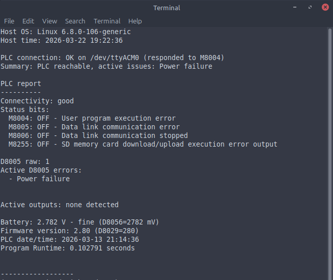

Library examples. IDK man the library isnt complete, and the docs arent complete, and Im still figuring a few things out. 
 

 
PLC Debugging. Just listing info related to diagnosing the PLC itself.
 
the User Application would be its own diagnostic process. 
BUT, having info about what the PLC lists as a problem is helpful.
 
You  might have output over current, or a dead CPU battery creating chaos for timed events.
 So I think its good to know if the hardware is working properly, before trying to diagnose USER application errors.
