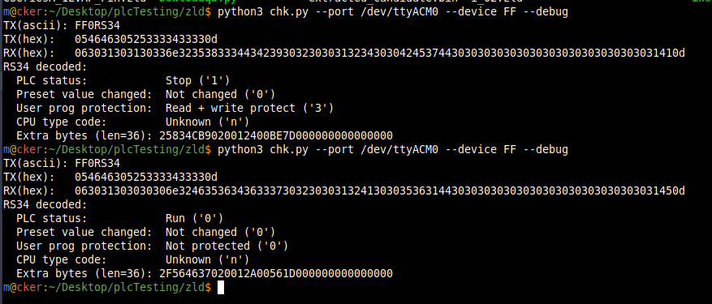

<pre>
# TODO :: add a variable for floating point percission
  IDEC max percision for a 32 bot register is 6
  Im not sure how the plc deals with it for real, 
  like gloabaly, or individualy
  discovered by reading D40/D41 prog ver e260=1.216
  as 1.2150000001367
  
</pre>

#Testing  
chk_plc.py: check the plc for password, and write protect over a USB (serial) connections 
 
 
