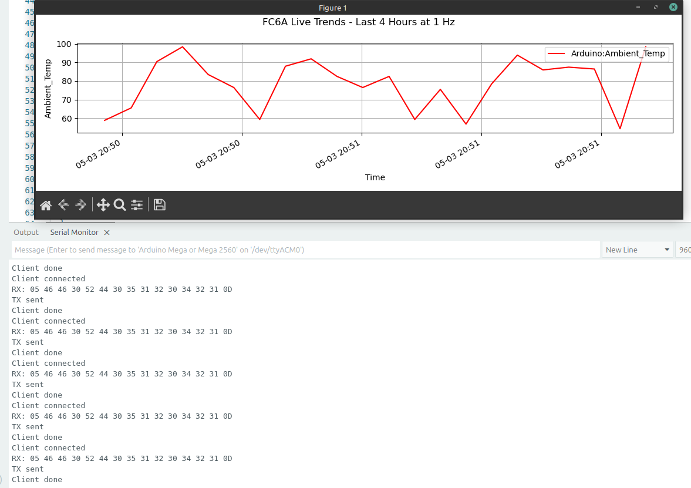
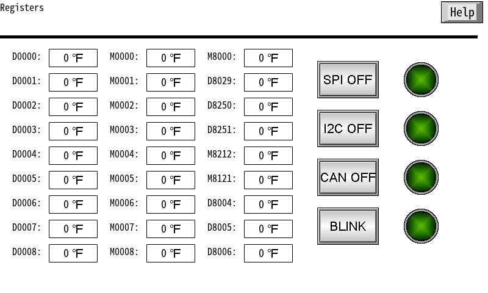

On The Line Project documentation, and developmental files: 
Objective: implement an Arduino as a Maintenance Protocol server. 
More about the challenge: 
<a href="https://community.element14.com/challenges-projects/design-challenges/on-the-line"> https://community.element14.com/
 
Test1: success! I can fool my own clients into responding to my arduino PLC server. 
The HMI is not buying my shenaningans, but i have a plan! 

integrate HMIs, PLCs, arduinos, and shields to provide additional  
features to both platforms.  

challenges-projects/design-challenges/on-the-line</a>
 

 Above: Random number gen from a custom monitoring app.

 
 
Future Testing interface:
 

